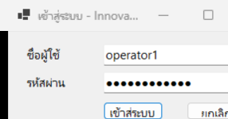
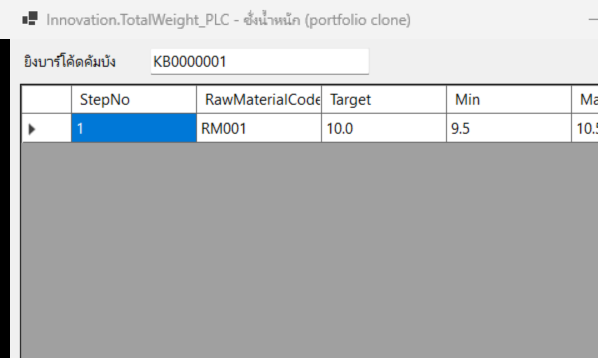
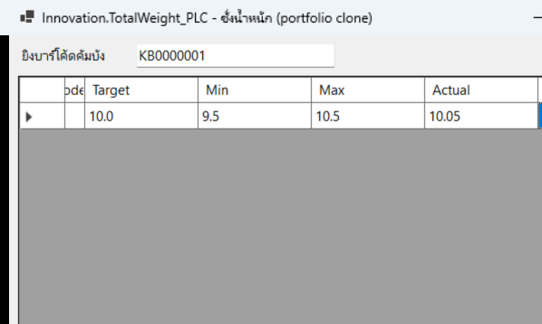
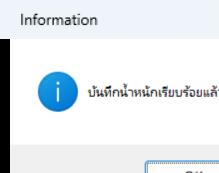

# Demo script

## Prerequisites

- .NET 8 SDK installed
- Windows (required for the WinForms desktop app)

## 1. Start the API

```bash
cd clone/src/Backend/Innovation.Api
dotnet run --urls http://localhost:5299
```

On first run this creates `totalweight.db` (SQLite), applies the
`InitialCreate` migration, and seeds one demo operator + one weighable
kanban via `DemoDataSeeder`.

## 2. Start the desktop app

In a second terminal:

```bash
cd clone/src/Desktop/Innovation.TotalWeight_PLC
dotnet run
```

## 3. Walk through the happy path

1. **Login dialog** appears first. Enter:
   - Username: `operator1`
   - Password: `Password123!`
2. Click **เข้าสู่ระบบ [Enter]**. On success the main weighing screen opens.
3. In **ยิงบาร์โค้ดคัมบัง**, type `KB0000001` and press **Enter**.
   - The steps grid populates with one row: step 1, raw material `RM001`,
     target 10.00, range [9.50, 10.50].
4. Click into the **Actual** cell of step 1, type `10.05`, and press Tab/Enter
   to commit the edit.
   - A weight inside the tolerance range is accepted silently; a weight
     outside it (try `12.00`) pops a warning and the cell reverts.
5. Click **บันทึก [F5]** (or press F5). A confirmation message appears
   ("บันทึกน้ำหนักเรียบร้อยแล้ว"), and the API withdraws 10.05 from `RM001`'s
   `RM_BAL` balance in the same database transaction.
6. Select the step row and click **ยืนยัน (Accept) [F2]** (or press F2). The
   row's Accepted checkbox flips to true.

## 4. Exercise the "must not close" scenarios

These aren't wired to a button in this trimmed UI (Phase 4 scope), but are
fully exercised by automated tests you can run to see the behavior directly:

```bash
dotnet test tests/Innovation.TotalWeight_PLC.Tests/Innovation.TotalWeight_PLC.Tests.csproj --filter Presenter_ShowAutoFeedTests
```

Each of the four failure scenarios (barcode not in RM_BAL, Feeddoor Step not
configured, DB write failure) asserts `view.DidNotReceive().CloseDialog(...)`
- the direct fix for the original `NotFound()` bug (Frontend ROADMAP §5b.2).

## 5. Screenshots

This walkthrough was run for real on Windows against the live API, driven
via UI Automation instead of by hand - each step below is an actual
screenshot, not a mockup.









Running this walkthrough for real caught two bugs that no unit test had
caught (both fixed, both now covered by regression tests) - see
[`RETROSPECTIVE.md`](RETROSPECTIVE.md) for details:

1. `Program.cs` only resolved `IView_TotalWeight` from the container, never
   `IPresenter_TotalWeight` - so the presenter (and its event subscriptions)
   was never constructed, and the barcode/save/accept actions silently did
   nothing.
2. `ShowMessage`'s icon mapping only special-cased `Error`, so `Information`
   messages showed a warning triangle instead of the info icon.
